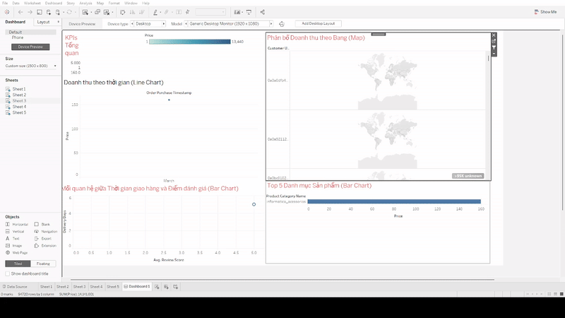

# Phân tích Nền tảng E-commerce Olist & Dự đoán Đánh giá Khách hàng

Dự án này thực hiện một quy trình phân tích dữ liệu end-to-end trên bộ dữ liệu công khai của Olist, một nền tảng thương mại điện tử lớn tại Brazil. Mục tiêu là rút ra các insight kinh doanh về hiệu suất vận hành và xây dựng một mô hình Machine Learning để dự đoán sự hài lòng của khách hàng.

---
### 📊 Dashboard Tương tác

Dưới đây là bản demo tương tác của dashboard. Để trải nghiệm đầy đủ, bạn có thể mở file `dashboard/retail_analysis.twbx` bằng Tableau.



---

### 🎯 Mục tiêu kinh doanh
* Phân tích hiệu suất của người bán (sellers) và quy trình giao vận (logistics).
* Tìm ra các yếu tố chính ảnh hưởng đến sự hài lòng của khách hàng (review score).
* Xây dựng mô hình dự đoán `review_score` để có thể can thiệp sớm vào các đơn hàng có nguy cơ bị đánh giá thấp.

---

### 🏛️ Kiến trúc hệ thống
Dự án được xây dựng theo một luồng dữ liệu end-to-end tiêu chuẩn:

`Dữ liệu thô (.csv) -> Python (ETL) -> MySQL (Database) -> Python (Phân tích & ML) -> Tableau (Trực quan hóa)`

!

---

### 🛠️ Hướng dẫn cài đặt và chạy dự án (Quickstart)

1.  **Clone repository:**
    ```bash
    git clone [https://github.com/Duy75973/olist-ecommerce-analysis.git](https://github.com/Duy75973/olist-ecommerce-analysis.git)
    cd olist-ecommerce-analysis
    ```

2.  **Thiết lập biến môi trường:**
    * Copy file `.env.example` thành `.env`.
    * Điền các thông tin `MYSQL_USER` và `MYSQL_PASSWORD` vào file `.env`.

3.  **Khởi động database (yêu cầu Docker):**
    ```bash
    docker-compose up -d
    ```

4.  **Tạo môi trường ảo và cài đặt thư viện:**
    ```bash
    python -m venv venv
    source venv/bin/activate  # Trên Windows: .\venv\Scripts\activate
    pip install -r requirements.txt
    ```

5.  **Chạy pipeline ETL để nạp dữ liệu:**
    ```bash
    python src/etl/main_etl.py
    ```

6.  **Mở và chạy các notebooks:**
    * Khởi động Jupyter: `jupyter notebook`
    * Mở các file trong thư mục `notebooks/`.

---

### 📈 Kết quả & Insights chính

* **Vận hành:** Thời gian giao hàng là yếu tố có ảnh hưởng **mạnh mẽ nhất** đến điểm đánh giá. Các đơn hàng giao trễ có điểm đánh giá trung bình thấp hơn đáng kể.
* **Kinh doanh:** Bang São Paulo (SP) là thị trường lớn nhất, chiếm phần lớn doanh thu. Các ngành hàng về "Nhà cửa & Đời sống" và "Sức khỏe & Sắc đẹp" là những ngành hàng chủ lực.
* **Machine Learning:** Mô hình `LightGBM` có thể dự đoán `review_score` với độ chính xác khoảng **XX.X%** (TODO: Điền độ chính xác bạn đạt được). Các feature quan trọng nhất bao gồm `delivery_delay`, `price`, và `freight_value`.

---